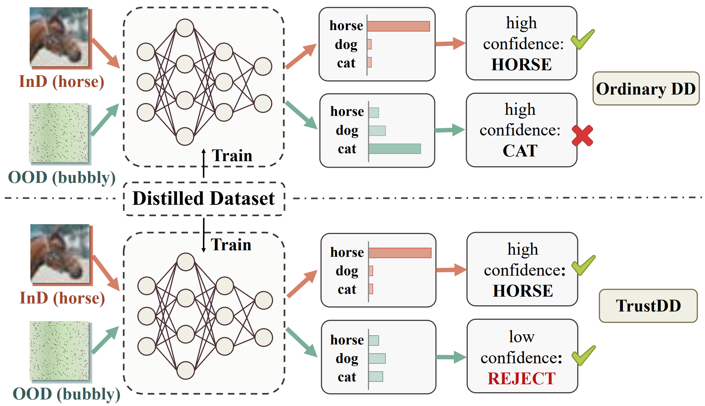

# TrustDD

Official implementation of our paper **Towards Trustworthy Dataset Distillation** [[arxiv](https://arxiv.org/abs/2307.09165)] [[Pattern Recognition](https://doi.org/10.1016/j.patcog.2024.110875)]


## Brief Introduction :star:

Efficiency and trustworthiness are two eternal pursuits when applying deep learning in real-world applications. With regard to efficiency, dataset distillation (DD) endeavors to reduce training costs by distilling the large dataset into a tiny synthetic dataset. However, existing methods merely concentrate on in-distribution (InD) classification in a closed-world setting, disregarding out-of-distribution (OOD) samples. On the other hand, OOD detection aims to enhance models’ trustworthiness, which is always inefficiently achieved in full-data settings. For the first time, we simultaneously consider both issues and propose a novel paradigm called Trustworthy Dataset Distillation (TrustDD). By distilling both InD samples and outliers, the condensed datasets are capable to train models competent in both InD classification and OOD detection. To alleviate the requirement of real outlier data and make OOD detection more practical, we further propose to corrupt InD samples to generate pseudo-outliers and introduce PseudoOutlier Exposure (POE). Comprehensive experiments on various settings demonstrate the effectiveness of TrustDD, and the proposed POE surpasses state-of-the-art method Outlier Exposure (OE). Compared with the preceding DD, TrustDD is more trustworthy and applicable to real open-world scenarios. 

The figure below depicts the difference between ordinary DD and TrustDD:



:warning:**NOTE!!!** TrustDD is a learning paradigm, and could be incorporated into any DD methods, in this repo, we implement [DSA](https://github.com/VICO-UoE/DatasetCondensation) as a prototype.

You can also incorporate OE/POE into other DD methods, e.g., [MTT](https://github.com/GeorgeCazenavette/mtt-distillation) to upgrade it to the version of TrustDD, which could be done by adding OE loss like [here](https://github.com/mashijie1028/TrustDD/blob/main/utils/dc_utils.py#L406).


## Running :running:

This repo uses PyTorch 1.7 (earlier version 1.4 or later version 1.10 might also work)

Before implementing TrustDD with OE, please download the outlier data [300K Random Images](https://people.eecs.berkeley.edu/~hendrycks/300K_random_images.npy) like [Outlier Exposure](https://github.com/hendrycks/outlier-exposure). For TrustDD with POE, there is no need to download the outlier data :smile:


### 1. Dataset Distillation

**Ordinary Dataset Distillation:**

```shell
CUDA_VISIBLE_DEVICES=0 python main.py  --dataset CIFAR10  --model ConvNet  --num_exp 3 --num_eval 5 --ipc 10  --init real  --method DSA  --dsa_strategy color_crop_cutout_flip_scale_rotate
```

**TrustDD with Outlier Exposure (OE):**

```shell
CUDA_VISIBLE_DEVICES=0 python main_oe.py  --dataset CIFAR10  --model ConvNet  --num_exp 1 --num_eval 5 --ipc 10  --init real  --method DSA  --dsa_strategy color_crop_cutout_flip_scale_rotate --seed 1  --lambda_oe 0.5 --num_oe_per_class 10000 --batch_real 256 --batch_oe 256
```

**TrustDD with Pseudo-Outlier Exposure (POE):**

```shell
CUDA_VISIBLE_DEVICES=0 python main_poe.py  --dataset CIFAR10  --model ConvNet  --num_exp 1 --num_eval 5 --ipc 10  --init real  --method DSA  --dsa_strategy color_crop_cutout_flip_scale_rotate --seed 1  --lambda_oe 0.5 --batch_real 256 --batch_oe 256
```

### 2. Train models with distilled datasets

**Train with distilled InD in Ordinary DD:**

```shell
CUDA_VISIBLE_DEVICES=0 python train_model_synthetic_no_oe.py --method DSA  --dataset CIFAR100 --model ConvNet --num_eval 5 --ipc 20 --dsa_strategy color_crop_cutout_flip_scale_rotate --folder 20230307-093217  --exp_idx 0
```

**Train with distilled InD and OOD in TrustDD (OE/POE):**

```shell
CUDA_VISIBLE_DEVICES=0 python train_model_synthetic_oe.py --method DSA  --dataset CIFAR10 --model ConvNet --num_eval 5 --ipc 10 --dsa_strategy color_crop_cutout_flip_scale_rotate --folder 20230206-232257  --exp_idx 0 --is_load_oe --lambda_oe 0.5
```

:warning: please specify the path args: `--load-path` and `--save-path`

### 3. Test OOD detection of models trained with distilled images

```shell
CUDA_VISIBLE_DEVICES=0 python test_ood_model_syn.py --method DSA  --dataset CIFAR10 --model ConvNet --batch_test 256 --num_exp 5 --ipc 10 --is_load_oe --folder 20230206-232250 --is_load_best --num_ood_ratio 1
```

:warning: please specify the path args: `--load-path` and `--save-path`​


## Citing this work :clipboard:

```
@article{MA2024110875,
title = {Towards trustworthy dataset distillation},
journal = {Pattern Recognition},
pages = {110875},
year = {2024},
issn = {0031-3203},
doi = {https://doi.org/10.1016/j.patcog.2024.110875},
url = {https://www.sciencedirect.com/science/article/pii/S0031320324006265},
author = {Shijie Ma and Fei Zhu and Zhen Cheng and Xu-Yao Zhang},
keywords = {Dataset distillation, Out-of-distribution detection, Data-efficient learning, Trustworthy learning}
}
```


## Acknowledgements :gift:

In building the AGCD codebase, we reference the repositories of [Dataset Condensation](https://github.com/VICO-UoE/DatasetCondensation) and [Outlier Exposure](https://github.com/hendrycks/outlier-exposure)


## License :white_check_mark:

This project is licensed under the MIT License - see the [LICENSE](https://github.com/mashijie1028/TrustDD/blob/main/LICENSE) file for details.


## Contact :email:

If you have further questions or discussions, feel free to contact me:

Shijie Ma (mashijie2021@ia.ac.cn)
